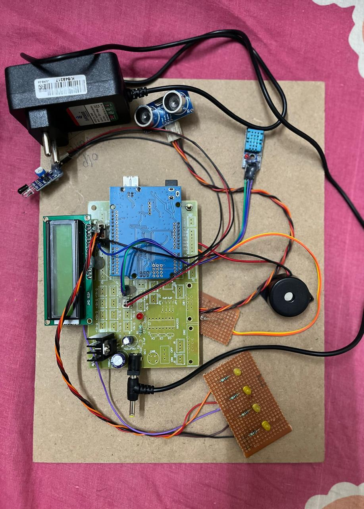

# 📌 Smart Blind Stick 
The Smart Blind Stick is an innovative assistive device designed to help visually impaired individuals navigate safely. It uses ultrasonic sensors to detect obstacles and beep sound alerts to warn users in real time.  

---

# 📂 Project Overview 
[Project Overview](ProjectOverview.jpg)  

---

# 🎯 Features 
✔ Real-time obstacle detection using ultrasonic sensors  
✔ Beep sound alerts for immediate feedback  
✔ Compact & lightweight design for easy portability  
✔ Energy-efficient for long-lasting use  
✔ Customizable with additional sensors or functionalities  

---

# 🔧 Project Components  
[View List of Components](ComponentsOfSmartBlindStick.pdf)  

---

# 📁 Project Files  
📄 Block Diagram – [View PDF](BlockDiagramofSmartBlindStick.pdf)  
📄 Code Implementation – [View C Code](SmartBlindStick.c)  
📄 Project Overview Image –   

---

# 🚀 Installation & Usage
# Step 1: Clone the Repository 
Run the following command in your terminal:  
```bash
git clone https://github.com/Harshniii/SmartBlindStick.git
```  

# Step 2: Open in Arduino IDE 
- Open SmartBlindStick.c in Arduino IDE  

# Step 3: Upload the Code  
- Connect the microcontroller to your PC  
- Click Upload

# Step 4: Power and Test  
- Power the Smart Blind Stick  
- Test its obstacle detection system  

---

# 🤝 Contributing 
We welcome contributions to improve this project! You can:  
📌 Report bugs
💡 Suggest new features 
📖 Improve documentation 
⚡ Optimize code efficiency  

Simply fork the repository and submit a pull request!  

---

# ❓ Have Questions 
If you have any questions or issues, feel free to:  
📩 Open an issue on GitHub  
📬 Reach out for collaboration

---


